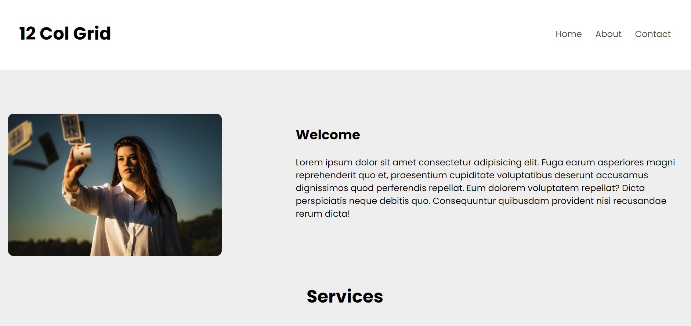

# CSS-Grid-Layouts
This Repo contains the basics of CSS grids and some example layouts using CSS grids 

### Basics
This site contains all variants of CSS Grid with examples.

Website Link : [Basics](https://lakshit-chiranjiv.github.io/CSS-Grid-Layouts/Basics/)

### Multi-Column-Layout

</img>

Website Link : [Multi-Column-Layout](https://lakshit-chiranjiv.github.io/CSS-Grid-Layouts/Multi-Column-Layout/)

### Holy-Grail-Layout

</img>

Website Link : [Holy-Grail-Layout](https://lakshit-chiranjiv.github.io/CSS-Grid-Layouts/Holy-Grail-Layout/)

### Masonry-Layout

</img>

Website Link : [Masonry Layout](https://lakshit-chiranjiv.github.io/CSS-Grid-Layouts/Masonry%20Layout/)

### Nested-Grid-Layout

</img>

Website Link : [Nested-Grid-Layout](https://lakshit-chiranjiv.github.io/CSS-Grid-Layouts/Nested-Grid-Layout/)

### 12-Column-Grid-Layout

</img>

Website Link : [12-Column-Grid-Layout](https://lakshit-chiranjiv.github.io/CSS-Grid-Layouts/12-Column-Layout/)
